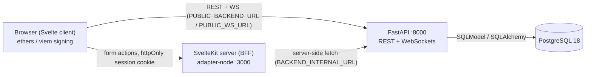
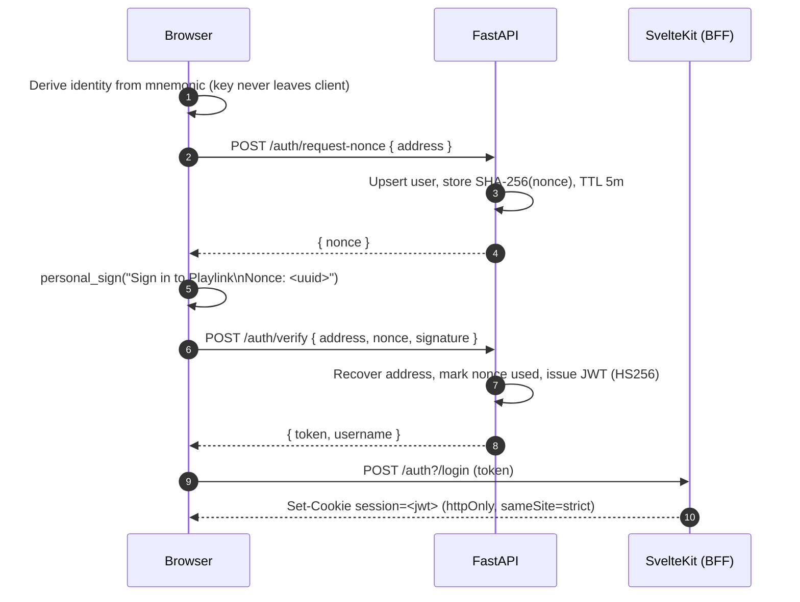

# Architecture Overview

Playlink is a full-stack **LFG (Looking-For-Group)** web application for organizing short-lived multiplayer game sessions ("rooms") for niche, retro, and less popular titles. It pairs a single-module **FastAPI** backend with a **SvelteKit** Backend-for-Frontend (BFF) and a **PostgreSQL** database, orchestrated with Docker Compose. Identity is **non-custodial**: every user is a BIP39 mnemonic whose derived key proves ownership via an ECDSA (EIP-191) signature challenge.

> **Source:** `backend/main.py`, `backend/models.py`, `frontend/src/`, `docker-compose.yml`, `backend/docs/auth-flow.md`

## System Topology



The browser talks to the backend **directly** for most reads and for both WebSocket channels. It talks to the SvelteKit server only for the operations that must touch the httpOnly `session` cookie (login/logout and the authenticated form actions), which the SvelteKit server proxies to the backend with the JWT attached.

## Technology Stack

| Layer            | Technology                                   | Tooling      |
| ---------------- | -------------------------------------------- | ------------ |
| Frontend         | SvelteKit 2 / Svelte 5 (runes), TypeScript   | Bun          |
| Signing          | ethers + viem (BIP39 + EIP-191)              | —            |
| Backend          | FastAPI (single module `main.py`), Python 3.14+ | uv        |
| ORM              | SQLModel (SQLAlchemy + Pydantic)             | —            |
| Database         | PostgreSQL 18 (prod) / SQLite in-memory (tests) | Docker    |
| Migrations       | Alembic                                      | uv           |
| Realtime         | FastAPI WebSockets                           | —            |
| Auth             | BIP39 identity + ECDSA (eth_account), JWT HS256 | —         |
| Rate limiting    | slowapi (REST) + per-address sliding window (chat WS) | —    |
| Orchestration    | Docker Compose (db, backend, frontend)       | Docker       |

## Repository Layout

```
.
├── backend/            FastAPI service
│   ├── main.py         All REST + WebSocket endpoints, managers, helpers, lifespan
│   ├── models.py       SQLModel tables (User, Room, RoomMember, Message, RoomEvent, …)
│   ├── database.py     Engine + session, Docker-aware DATABASE_URL rewrite
│   ├── usernames.py    Username format + profanity validation
│   ├── alembic/        Migration environment + versions
│   ├── tests/          Pytest suite (SQLite + TestClient)
│   └── docs/           auth-flow.md specification
├── frontend/           SvelteKit application
│   └── src/
│       ├── lib/        Client logic: auth, signing, stores, contexts, UI kit
│       ├── routes/     Pages + server loaders/actions
│       └── hooks.server.ts  Session-cookie decode hook
├── docker-compose.yml  db + backend + frontend services
└── docs/               This documentation set
```

## Core Domain Concepts

- **Identity / User** — derived from a 12-word BIP39 mnemonic; stored as an EIP-55 checksummed `identity_address` with a persistent random `username`. There is no password.
- **Room** — a named, capacity-limited, expiring game session tied to a `Game` and a `lobby_location`. The creator auto-joins; a user may own at most 3 active rooms.
- **RoomMember** — the link table joining users to rooms.
- **Message** — a chat message scoped to a room, optionally signed (EIP-191) by its sender for verifiable authorship.
- **RoomEvent / RoomEventRsvp** — an optional scheduled gathering on a room with per-member RSVPs (`present` / `absent` / `maybe`).
- **Game** — a catalog category, ordered by `sort_order`; admins can add/remove categories.
- **Nonce** — a one-time, hashed, short-lived challenge backing the auth flow.

A full field-level breakdown is in the [data model reference](backend/data-model.md); schema history is in [migrations](backend/migrations.md).

## Key Flows

### 1. Authentication (non-custodial challenge-response)



The JWT never reaches client-side JavaScript: the browser hands it to the SvelteKit `login` action, which stores it in an httpOnly cookie. Server loaders decode it (`jwt-decode`) and expose only the address/username/admin flag to pages. See [auth-flow.md](../backend/docs/auth-flow.md) for the full specification and the [configuration reference](backend/configuration.md) for JWT/nonce TTL tuning.

### 2. Room lifecycle and the live room list

Authenticated users create/join/leave rooms over REST. Every mutation broadcasts the full room list to all clients connected to the `/ws/rooms` WebSocket, and a background task prunes expired rooms every `ROOM_CLEANUP_INTERVAL_SECONDS`. See the [API reference](backend/api-reference.md) and [realtime reference](backend/realtime.md).

### 3. Per-room chat with verifiable authorship

Each room exposes a JWT-authenticated, membership-gated chat channel at `/ws/rooms/{name}/chat`. Messages are signed with the sender's BIP39-derived key (EIP-191) so authorship is verifiable end-to-end rather than trusted on the JWT alone; the server reconstructs a canonical message string and rejects timestamps drifting more than `CHAT_SIGNATURE_SKEW_SECONDS` to blunt replay. The same channel carries event, RSVP, roster, room-closed, and kick frames. Full frame catalog in the [realtime reference](backend/realtime.md).

## Security Model (summary)

- **Non-custodial keys** — the private key never leaves the browser; the backend only verifies proofs.
- **Replay protection** — nonces are single-use, hashed at rest (SHA-256), short-lived, and invalidated on re-request.
- **BFF / XSS hardening** — the session JWT lives in an httpOnly, `sameSite=strict` cookie set by the SvelteKit server.
- **Authorization** — admin authority lives only in the `ADMIN_ADDRESSES` environment variable (no `is_admin` column); see [configuration](backend/configuration.md).
- **Rate limiting** — slowapi caps REST traffic (default `10/minute`); chat WS enforces a per-address sliding-window limit.
- **Network isolation** — Postgres has no host port mapping in Compose by design (Docker bypasses host firewalls); see [deployment](operations/deployment.md).

## Where to go next

- [Documentation index](index.md) — full map of these docs.
- [Backend API reference](backend/api-reference.md) · [Realtime reference](backend/realtime.md) · [Data model](backend/data-model.md)
- [Frontend library](frontend/library.md) · [Routes](frontend/routes.md) · [Components](frontend/components.md)
- [Configuration](backend/configuration.md) · [Migrations](backend/migrations.md) · [Testing](operations/testing.md) · [Deployment](operations/deployment.md)
